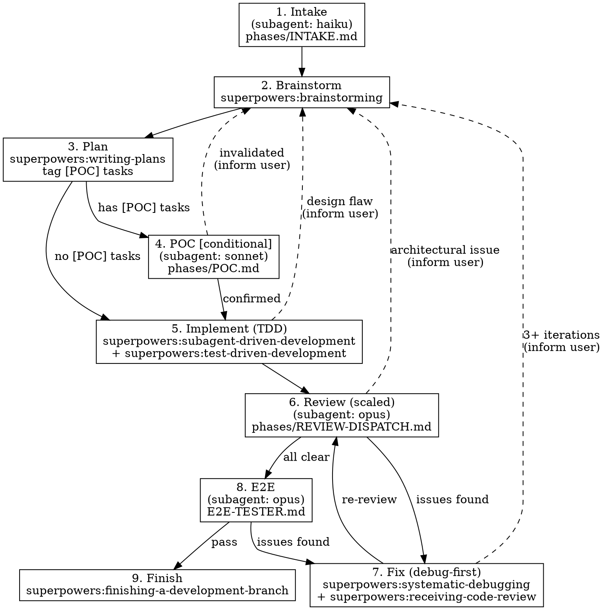

# Dev Loop

End-to-end autonomous development workflow: GitHub issue in, completed branch out.

**Announce at start:** "I'm using the dev-loop skill to work on issue #N."

## When to Use

- Starting work on a GitHub issue (feature, bug fix, enhancement, refactor)
- Non-trivial work that benefits from structured process

**Don't use for:** Quick typo fixes, single-line config changes, documentation-only updates.

## Pipeline

## Phase Reference

| Phase | Skill / File | Dispatched as | Knowledge save |
|-------|-------------|---------------|----------------|
| 1. Intake | `phases/INTAKE.md` | Subagent (haiku) | — |
| 2. Brainstorm | `superpowers:brainstorming` | Main context | `decision` |
| 3. Plan | `superpowers:writing-plans` | Main context | — |
| 4. POC | `phases/POC.md` | Subagent (sonnet) | `finding` |
| 5. Implement | `superpowers:subagent-driven-development` + `superpowers:test-driven-development` | Main context | `learning` |
| 6. Review | `phases/REVIEW-DISPATCH.md` | Subagent (opus) | — |
| 7. Fix | `superpowers:systematic-debugging` + `superpowers:receiving-code-review` | Main context | `learning` |
| 8. E2E | `E2E-TESTER.md` + `superpowers:verification-before-completion` | Subagent (opus) | — |
| 9. Finish | `superpowers:finishing-a-development-branch` | Main context | `decision` |

For knowledge store patterns and field values, see `phases/KNOWLEDGE.md`.

## Phase Gates

| Phase | Exit condition |
|-------|----------------|
| 1 | Issue claimed, context gathered, branch created |
| 2 | Design approved by user |
| 3 | Plan reviewed; `[POC]` tasks tagged if assumptions are uncertain |
| 4 | All assumptions validated (or user informed of invalidation) |
| 5 | All tasks implemented with passing tests |
| 6 | Review verdicts collected |
| 7 | All Critical/Important/Low issues fixed |
| 8 | All E2E tests pass |
| 9 | Branch completed per user's choice (PR, merge, or cleanup) |

## Phase-Specific Notes

### Phase 3: Plan

The plan MUST tag tasks with `[POC]` when they involve unvalidated assumptions.
Examples: "does this API support streaming?", "will concurrent writes conflict?",
"is this library compatible with our MSRV?"

### Phase 4: POC (Conditional)

Only runs if the plan contains `[POC]`-tagged tasks. Dispatches a sonnet subagent
using `phases/POC.md`. Results determine next step:
- All confirmed → proceed silently to Phase 5
- Any invalidated → inform user, pivot to Phase 2 with findings
- Partially confirmed → inform user, let them decide

### Phase 5: Implement (TDD)

Each implementation subagent uses BOTH `superpowers:subagent-driven-development`
and `superpowers:test-driven-development`. The TDD cycle (red → green → refactor)
applies per task. Commit after each completed task.

### Phase 6: Review (Scaled)

Dispatches an opus subagent using `phases/REVIEW-DISPATCH.md` which determines
review tier by diff size:
- < 50 lines → 2 reviewers (Senior SWE + QA)
- 50-200 lines → 3 reviewers (+ PM)
- 200+ lines → 5 reviewers (+ 2 dynamic from `REVIEWER-PERSONAS.md`)

Issue label `review:full` overrides to 5 reviewers.

### Phase 7: Fix (Debug-First)

Invoke `superpowers:systematic-debugging` BEFORE attempting any fix. Root cause
first, then fix. Process review feedback with `superpowers:receiving-code-review`.
Fix by severity: Critical → Important → Low. Re-review only changed areas.
Max 3 fix-review iterations before escalating to user.

## Pivot Rules

- **Expected outcome** → proceed autonomously
- **Unexpected outcome / broken assumption** → inform user before pivoting

| Discovery | Pivot to |
|-----------|----------|
| POC invalidates assumption | Phase 2 (Brainstorm) |
| Implementation hits design flaw | Phase 3 (Plan) or Phase 2 (Brainstorm) |
| Review flags architectural issue | Phase 2 (Brainstorm) or Phase 4 (POC) |
| E2E reveals approach doesn't work | Phase 4 (POC) |
| Fix loop exceeds 3 iterations | Escalate → Phase 2 (Brainstorm) |

**Pivot protocol:**
1. Stop current phase
2. Summarize finding and proposed pivot target
3. Inform user
4. Wait for acknowledgment
5. Jump to target phase with accumulated context

## Red Flags

**STOP and reassess if:**
- Fix-review loop exceeds 3 iterations
- E2E reveals issues in unrelated areas (regression)
- Implementation diverges from approved design
- Any reviewer flags security or data-loss concern

**Never:**
- Skip Phase 2 brainstorming
- Merge without passing tests
- Force-push to any shared branch
- Proceed past a gate without meeting its criteria

## Autonomy Guidelines

1. **Proceed without asking** through Phases 1-5 if the issue is well-specified
2. **Pause and ask** if:
   - The issue is ambiguous or has conflicting requirements
   - Brainstorming produces fundamentally different approaches
   - A reviewer flags a design-level concern
3. **Always notify** the user when:
   - Phase 6 review completes (with verdicts)
   - Phase 8 E2E completes (with results)
   - Phase 9 finish completes (with PR link or merge confirmation)
