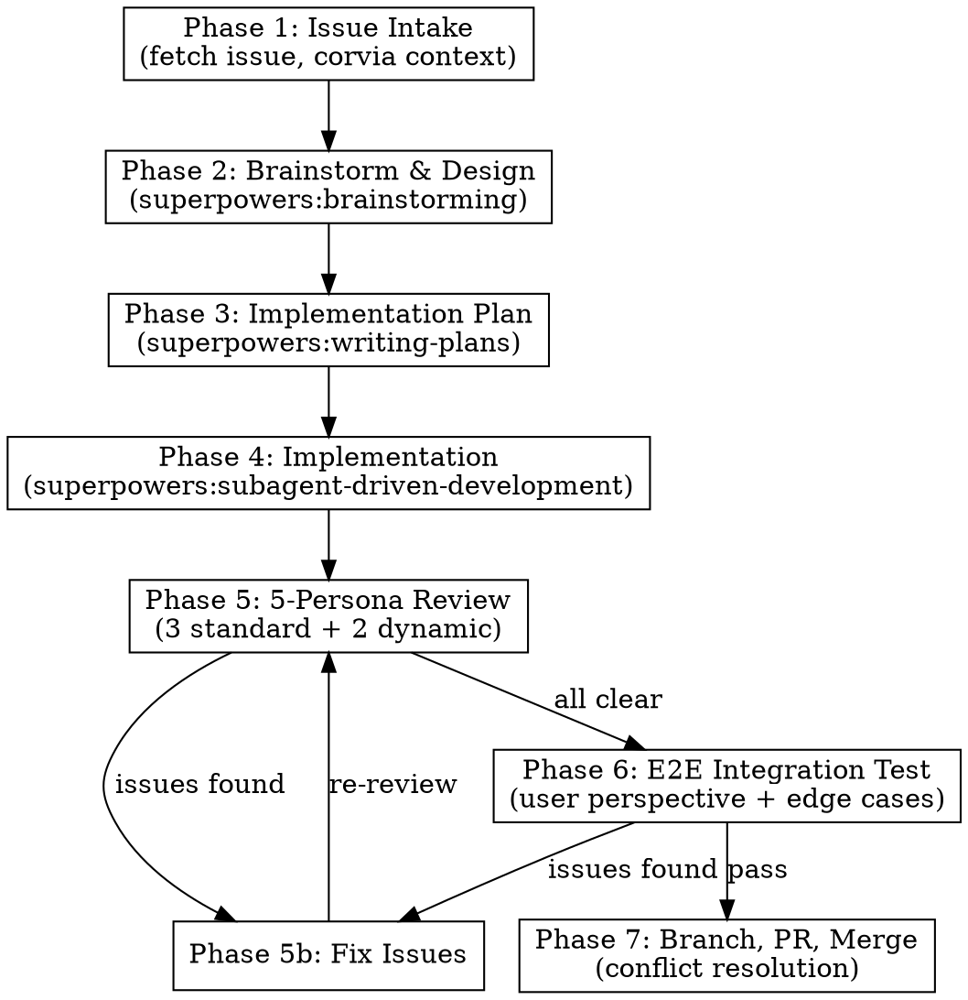
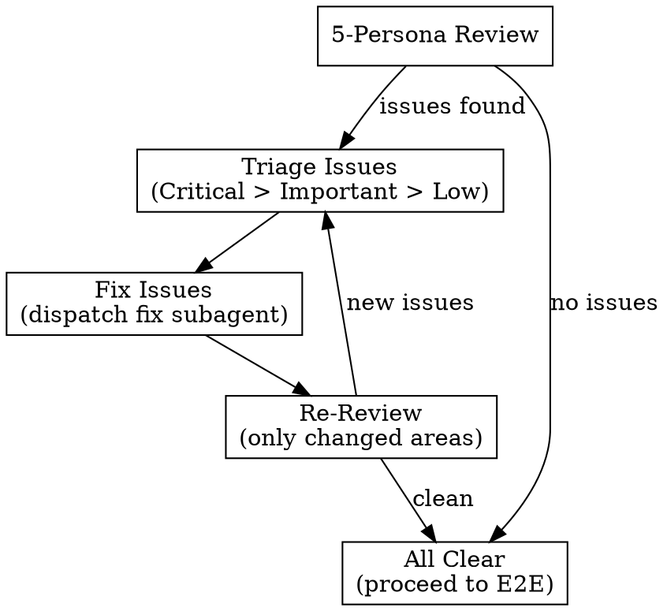

# Dev Loop

## Overview

End-to-end autonomous development workflow: GitHub issue in, merged PR out. Orchestrates
superpowers skills into a single disciplined pipeline with mandatory quality gates.

**Core principle:** Issue -> Context -> Brainstorm -> Plan -> Implement -> 5-Persona Review
-> Fix Loop -> E2E Test -> Branch/PR -> Merge.

**Announce at start:** "I'm using the dev-loop skill to work on issue #N."

## When to Use

- Starting work on a GitHub issue (feature, bug fix, enhancement, refactor)
- The issue has a prompt or description ready
- You want autonomous execution with minimal human intervention
- Non-trivial work that benefits from structured process

**Don't use for:** Quick typo fixes, single-line config changes, or documentation-only updates.

## The Process



---

## Phase 1: Issue Intake

**Goal:** Gather all context before any code work.

### Step 1.1: Fetch the GitHub Issue

```bash
gh issue view <NUMBER> --json title,body,labels,assignees,milestone
```

Extract:
- **Title** and **description/prompt**
- **Labels** (bug, feature, enhancement, etc.) — determines dynamic reviewers
- **Acceptance criteria** (if present)
- **Linked issues/PRs**

### Step 1.2: Query corvia for Context

```
corvia_search: "<issue title and key terms>"
corvia_ask: "What prior decisions relate to <feature/area>?"
corvia_context: scope_id=corvia
```

Record what corvia returns — this informs brainstorming.

### Step 1.3: Create Feature Branch

```bash
# Branch naming: <type>/<issue-number>-<short-description>
git checkout -b feat/<NUMBER>-<short-desc> master
```

Branch types: `feat/`, `fix/`, `refactor/`, `chore/` — match issue labels.

---

## Phase 2: Brainstorm & Design

**Invoke:** `superpowers:brainstorming`

Feed the brainstorming skill:
- The issue prompt/description
- corvia context from Phase 1
- Any constraints from labels or milestone

**Hard gate:** Design MUST be approved before proceeding. No shortcuts.

**Output:** Design doc written to `docs/superpowers/specs/YYYY-MM-DD-<topic>-design.md`

---

## Phase 3: Implementation Plan

**Invoke:** `superpowers:writing-plans`

The plan is generated from the approved design. It breaks work into discrete,
independently-testable tasks.

**Output:** Plan written to `docs/superpowers/plans/YYYY-MM-DD-<topic>-plan.md`

---

## Phase 4: Implementation

**Invoke:** `superpowers:subagent-driven-development`

Execute the plan task-by-task with subagents. Each task gets:
- Fresh implementer subagent
- Spec compliance review
- Code quality review
- Fix loops until both reviews pass

**Commit cadence:** Commit after each completed task (not at the end).

---

## Phase 5: 5-Persona Review

After all implementation tasks are complete, dispatch **five independent reviewer
subagents** in parallel. Three are standard; two are dynamic based on the task.

### Standard Reviewers (Always Present)

| Persona | Focus | Prompt Template |
|---------|-------|-----------------|
| **Senior SWE** | Correctness, safety, idiomatic patterns, edge cases, performance | `./five-persona-reviewer.md` with `{PERSONA}=senior-swe` |
| **Product Manager** | Goal alignment, UX coherence, milestone advancement, scope | `./five-persona-reviewer.md` with `{PERSONA}=product-manager` |
| **QA Engineer** | Test coverage, E2E verification, failure modes, regression risk | `./five-persona-reviewer.md` with `{PERSONA}=qa-engineer` |

### Dynamic Reviewers (Task-Dependent)

Select **two** additional reviewers based on issue labels and changed files:

| Issue Type | Dynamic Persona 1 | Dynamic Persona 2 |
|------------|-------------------|-------------------|
| **Performance/optimization** | Performance Engineer | Database/Storage Specialist |
| **Security/auth** | Security Engineer | Compliance Reviewer |
| **API/integration** | API Design Reviewer | Backwards Compatibility Reviewer |
| **UI/dashboard** | UX Designer | Accessibility Reviewer |
| **Infrastructure/devops** | SRE/Platform Engineer | Container/Deploy Specialist |
| **Data/embedding/ML** | ML Engineer | Data Pipeline Reviewer |
| **Rust-specific** | Rust Idiom Reviewer | Unsafe/Lifetime Reviewer |
| **General feature** | Domain Expert (for the feature area) | Developer Experience Reviewer |

### Dispatching Reviews

```
# Get git range for review
BASE_SHA=$(git merge-base HEAD master)
HEAD_SHA=$(git rev-parse HEAD)

# Dispatch ALL 5 reviewers in PARALLEL as independent subagents
# Each reviewer uses ./five-persona-reviewer.md with their persona filled in
```

**CRITICAL:** Each reviewer MUST be a deep, independent subagent run. Not a shallow
one-liner that rubber-stamps approval. If a reviewer returns less than 10 lines of
substantive feedback, the review is invalid — re-dispatch with explicit instructions
to be thorough.

### Review Severity Levels

| Level | Action Required |
|-------|----------------|
| **Critical** | MUST fix before proceeding. Blocks merge. |
| **Important** | MUST fix before proceeding. Blocks merge. |
| **Low** | MUST fix. Does not block E2E testing but blocks merge. |
| **Minor/Nitpick** | Optional. Note for future. Does NOT block merge. |

### Fix Loop



**Fix order:** Critical first, then Important, then Low. Fix in batches by severity.

**Re-review scope:** Only re-review the areas that changed during fixes, not the entire
codebase. Dispatch a focused reviewer subagent for the fix diff.

**Loop limit:** If the fix-review loop exceeds 3 iterations, STOP and escalate to the
user. Something is structurally wrong.

---

## Phase 6: E2E Integration Testing

After all review issues are resolved, perform end-to-end testing from the user's
perspective.

### Step 6.1: Happy Path Testing

Walk through the primary use case as a user would:
- Start from the entry point (CLI command, API call, UI action)
- Exercise the full feature path
- Verify expected outputs

### Step 6.2: Edge Case Testing

Think adversarially. Test:
- **Empty/null inputs** — what happens with no data?
- **Boundary values** — max sizes, zero, negative, unicode
- **Concurrent access** — if applicable, test parallel operations
- **Error recovery** — kill mid-operation, corrupt input, network failure
- **Backwards compatibility** — does existing functionality still work?
- **Configuration variants** — different settings combinations

### Step 6.3: Integration Points

Test interactions between the changed code and:
- Other components in the system
- External services (MCP, APIs)
- Data storage (read/write/migration)
- Build system (cargo build, cargo test, cargo clippy)

### Step 6.4: Run Full Test Suite

```bash
# Build
cargo build 2>&1

# Run all tests
cargo test 2>&1

# Clippy (if Rust)
cargo clippy -- -D warnings 2>&1
```

**All must pass.** If any fail, loop back to fix.

### Step 6.5: Manual Verification

Use the Playwright MCP or direct CLI testing to verify the feature works as a real
user would experience it. Document what you tested and the results.

**Output:** Brief E2E test report — what was tested, what passed, any issues found.

---

## Phase 7: Branch, PR, Merge

### Step 7.1: Final Commit

Ensure all changes are committed with descriptive messages. Squash fixup commits
if the history is noisy (but preserve meaningful task-level commits).

### Step 7.2: Push and Create PR

```bash
git push -u origin <branch-name>

gh pr create --title "<concise title under 70 chars>" --body "$(cat <<'EOF'
## Summary
<2-3 bullets: what changed and why>

## Changes
<list of key changes by area>

## Test Plan
- [ ] Unit tests pass (cargo test)
- [ ] Clippy clean (cargo clippy)
- [ ] E2E verification: <specific scenarios tested>
- [ ] Edge cases tested: <list>

## Review
5-persona review completed:
- Senior SWE: <verdict>
- Product Manager: <verdict>
- QA Engineer: <verdict>
- <Dynamic 1>: <verdict>
- <Dynamic 2>: <verdict>

Closes #<NUMBER>

Generated with [Claude Code](https://claude.com/claude-code)
EOF
)"
```

### Step 7.3: Merge

```bash
# Update master
git checkout master
git pull origin master

# Merge the PR branch
git merge <branch-name>

# If conflicts arise:
# 1. Identify conflicting files
# 2. Resolve conflicts (prefer the feature branch for new code,
#    preserve master's fixes for areas outside our changes)
# 3. Run tests after resolution
# 4. Commit the merge resolution

# Push
git push origin master
```

**Conflict resolution strategy:**
- Read both sides of every conflict carefully
- For conflicts in files we changed: merge intelligently (don't just pick one side)
- For conflicts in files we didn't change: prefer master's version
- **Always run full test suite after conflict resolution**
- If conflicts are complex (>3 files or architectural), escalate to the user

### Step 7.4: Cleanup

```bash
# Delete feature branch (remote and local)
git push origin --delete <branch-name>
git branch -d <branch-name>
```

### Step 7.5: Record in corvia

```
corvia_write: Record the implementation decision, any non-obvious patterns discovered,
and the review outcomes for future reference.
```

### Step 7.6: Commit Knowledge Store

`corvia_write` creates JSON files in `.corvia/knowledge/` but does NOT commit them.
The knowledge store is Git-tracked, so you must commit and push after writing.

```bash
# From the workspace root (corvia-workspace), not the code repo
git add .corvia/knowledge/
git commit -m "chore: sync corvia knowledge store (<brief description>)"
git pull --rebase origin master  # workspace repo may have other changes
git push origin master
```

**Why this is separate from Step 7.3:** The code lives in `repos/corvia/` (code repo)
but knowledge JSON lives in `.corvia/` (workspace repo). They are different git
repositories with different remotes. The code merge in 7.3 pushes to the code repo;
this step pushes to the workspace repo.

---

## Quick Reference

| Phase | Skill/Tool | Gate | Output |
|-------|-----------|------|--------|
| 1. Intake | `gh issue view`, `corvia_search` | Issue exists | Context gathered, branch created |
| 2. Brainstorm | `superpowers:brainstorming` | Design approved | Design doc |
| 3. Plan | `superpowers:writing-plans` | Plan reviewed | Plan doc |
| 4. Implement | `superpowers:subagent-driven-development` | Per-task reviews pass | Working code |
| 5. Review | `./five-persona-reviewer.md` x5 | All Critical/Important/Low fixed | Clean review |
| 6. E2E Test | Manual + automated | All tests pass | Test report |
| 7. PR/Merge | `gh pr create`, `git merge` | No conflicts (or resolved) | Merged to master |
| 7.6 Knowledge | `corvia_write`, `git push` | Knowledge JSON committed | Workspace repo pushed |

## Common Mistakes

**Skipping corvia lookup**
- **Problem:** Re-discover decisions already made, contradict existing patterns
- **Fix:** Phase 1 corvia queries are mandatory, not optional

**Shallow reviews**
- **Problem:** Reviewer returns "LGTM" with no substance
- **Fix:** Each reviewer must produce 10+ lines of substantive feedback. Re-dispatch if not.

**Fixing during review instead of after**
- **Problem:** Context pollution, partial fixes, lost review state
- **Fix:** Collect ALL review feedback first, then fix in batches by severity

**Skipping E2E because unit tests pass**
- **Problem:** Integration failures, UX issues, edge cases missed
- **Fix:** E2E is a separate mandatory phase. Unit tests are necessary but not sufficient.

**Merging with failing tests**
- **Problem:** Broken master
- **Fix:** Full test suite must pass AFTER merge conflict resolution, before push

**Not recording in corvia**
- **Problem:** Next session re-discovers the same things
- **Fix:** Phase 7.5 corvia_write is mandatory for non-trivial discoveries

**Forgetting to commit knowledge JSON**
- **Problem:** `corvia_write` creates the file but it sits uncommitted in `.corvia/knowledge/`
- **Fix:** Phase 7.6 — always `git add .corvia/knowledge/ && git commit && git push` after corvia_write

## Red Flags

**STOP and reassess if:**
- Fix-review loop exceeds 3 iterations (structural problem)
- E2E reveals issues in unrelated areas (regression)
- Merge conflicts span >3 files (may need rebase strategy)
- Any reviewer flags a security or data-loss concern (escalate immediately)
- Implementation diverges significantly from the approved design

**Never:**
- Skip Phase 2 brainstorming ("it's simple enough")
- Skip any of the 5 reviewers ("3 is enough")
- Merge to master without passing tests
- Force-push to any shared branch
- Delete a branch before the PR is merged
- Proceed past a hard gate without meeting its criteria

## Autonomy Guidelines

This skill is designed for autonomous operation. The agent should:

1. **Proceed without asking** through Phases 1-4 if the issue is well-specified
2. **Pause and ask** if:
   - The issue is ambiguous or has conflicting requirements
   - Brainstorming produces fundamentally different approaches (present options)
   - A reviewer flags a design-level concern (not just code-level)
   - Merge conflicts are complex
3. **Always notify** the user with a summary when:
   - Phase 5 review completes (with verdicts)
   - Phase 6 E2E completes (with results)
   - Phase 7 merge completes (with PR link)

## Integration

**Orchestrates these superpowers skills:**
- `superpowers:brainstorming` (Phase 2)
- `superpowers:writing-plans` (Phase 3)
- `superpowers:subagent-driven-development` (Phase 4)
- `superpowers:requesting-code-review` (Phase 5, adapted)
- `superpowers:receiving-code-review` (Phase 5b)
- `superpowers:verification-before-completion` (Phase 6)
- `superpowers:finishing-a-development-branch` (Phase 7, adapted)

**Uses these tools:**
- `gh` CLI (issue fetch, PR creation)
- `corvia_search`, `corvia_ask`, `corvia_context`, `corvia_write` (MCP)
- `cargo` (build, test, clippy)
- Playwright MCP (optional, for UI verification)
